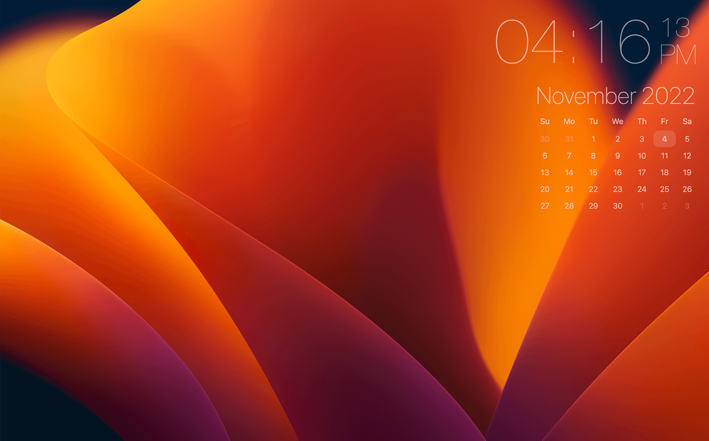

# Übersicht Clock and calendar widget

## Installation:

1. Move ubershicht-clock-calendar.widget to your Ubersicht widgets folder.
2. Enjoy!

## Customization:

Easy to edit with CSS (colors, position, sizes, etc.)
